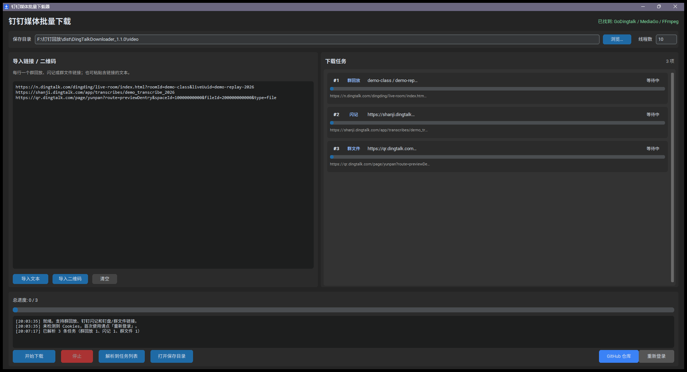
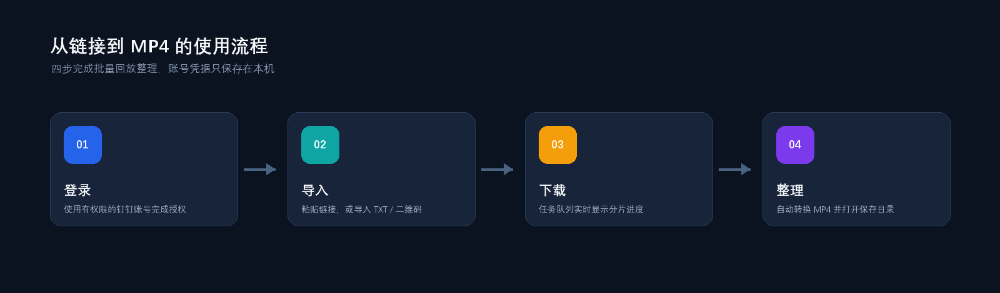

<p align="center">
  
</p>

<h1 align="center">钉钉回放批量下载器</h1>

<p align="center">
  面向 Windows 的钉钉直播回放图形化整理工具：批量导入、实时追踪、自动转换，一处完成。
</p>

<p align="center">
  <a href="https://github.com/ULing19/DingTalkDownloader/releases">下载最新安装包</a>
  ·
  <a href="https://github.com/NAXG/GoDingtalk">查看上游引擎</a>
  ·
  <a href="https://github.com/ULing19/DingTalkDownloader/issues">反馈问题</a>
</p>

## 界面预览

下面的预览图展示了完整工作区：左侧导入链接，右侧查看任务，底部观察总进度和日志；底部控制区内置“GitHub 仓库”入口。

<p align="center">
  
</p>

## 它能做什么

| 能力 | 说明 |
| --- | --- |
| 批量粘贴 | 一次粘贴多行回放链接，自动去重并生成任务 |
| 文本导入 | 直接导入各科目或各批次的 `.txt` 链接文件，支持 `#` 注释行 |
| 二维码导入 | 多选 PNG、JPG、BMP、WebP 等图片，自动识别回放地址 |
| 实时进度 | 显示当前任务、分片数量、百分比、错误信息和总进度 |
| 自动整理 | 调用 FFmpeg 将下载得到的 TS 分片转换为 MP4 |
| 登录复用 | 通过“重新登录”重新授权，Cookies 仅保存到本机配置目录 |
| 目录选择 | 每次下载可选择保存位置，也可以直接打开保存目录 |

## 工作流程

<p align="center">
  
</p>

1. 点击“重新登录”，用有权限观看回放的钉钉账号完成授权。
2. 将回放链接粘贴到左侧，或导入文本文件、二维码图片。
3. 选择保存目录和线程数，点击“解析到任务列表”检查任务。
4. 点击“开始下载”，在右侧任务列表中观察进度；完成后得到 MP4 文件。

## 安装与运行

### 使用安装包

从 [Releases](https://github.com/ULing19/DingTalkDownloader/releases) 下载单个文件 `DingTalkDownloader_Installer.exe`，按向导安装即可。这个安装程序已经把 GUI、GoDingtalk 引擎和 FFmpeg 一起打包，不需要再手动拼接文件。安装程序、桌面快捷方式和主程序统一使用下载箭头图标。

首次运行：

1. 点击“重新登录”，等待 GoDingtalk 打开 Chrome/Chromium 登录。
2. 登录完成后返回程序，粘贴或导入回放链接。
3. 选择目录并开始下载。

Windows SmartScreen 可能提示程序未签名；这是未购买代码签名证书的正常提示。请只从本项目 Release 下载，并在运行前核对 Release 页面提供的 SHA-256。

安装后可从开始菜单的“钉钉回放批量下载器”文件夹、Windows“应用和功能”，或安装目录中的卸载程序直接卸载。卸载向导会询问是否同时删除已下载视频和登录配置，默认保留用户数据。

### 绿色版

如果不想安装，下载 Release 中的 `DingTalkDownloader_Release.zip`。解压后保持下面三个文件在同一目录，然后双击 `DingTalkDownloader.exe`：

```text
DingTalkDownloader.exe
GoDingtalk_v2.5.2_windows_amd64.exe
ffmpeg.exe
```

## 从源码运行

适用环境：Windows 10/11、Python 3.9 或更高版本、Google Chrome/Chromium。

### 准备运行时组件

本项目只提交 GUI 源码，不把本地账号、视频和大体积运行时二进制放进 Git 历史。请分别获取：

- `GoDingtalk_v2.5.2_windows_amd64.exe`：来自 [NAXG/GoDingtalk Releases](https://github.com/NAXG/GoDingtalk/releases)，放在项目根目录。
- `ffmpeg.exe`：来自 [FFmpeg 官方下载页](https://ffmpeg.org/download.html)，放在项目根目录。

### 安装依赖并启动

```powershell
python -m pip install -r requirements-gui.txt
python gui_downloader.py
```

依赖包括：`customtkinter`、`Pillow`、`opencv-python-headless`。二维码识别失败时，优先检查图片清晰度和 OpenCV 安装状态。

### 构建 EXE 和安装包

```powershell
build_exe.bat
build_installer.bat
```

`build_exe.bat` 使用 PyInstaller 生成单文件 GUI，并组装绿色版目录；`build_installer.bat` 使用 Inno Setup 6 生成安装包。两条脚本都会使用 `assets/download.ico`，因此应用窗口、EXE、快捷方式和安装程序图标保持一致。

## 项目结构

```text
gui_downloader.py              # CustomTkinter 主界面与下载任务队列
requirements-gui.txt           # Python 依赖
DingTalkDownloader.spec        # PyInstaller 配置
build_exe.bat                  # 生成 EXE 与绿色版目录
build_installer.bat            # 编译 Inno Setup 安装程序
installer/setup.iss            # 安装向导、快捷方式与卸载逻辑
assets/download.ico            # 多尺寸下载箭头图标
docs/images/                   # README 预览图与流程图
```

运行后可能出现的目录：

```text
.goDingtalkConfig/config.json  # 本机配置
.goDingtalkConfig/cookies.json # 登录会话，严禁分享
video/                          # 默认视频保存目录
```

## 常见问题

**提示“未找到 GoDingtalk 可执行文件”**

确认 `GoDingtalk_v2.5.2_windows_amd64.exe` 与 `DingTalkDownloader.exe` 位于同一目录，且文件名没有被改动。

**下载失败或提示未登录**

点击“重新登录”重新授权；账号必须有权限查看对应回放。不要把自己的 `cookies.json` 发给别人。

**只有 TS 没有 MP4**

确认 `ffmpeg.exe` 与 GUI 位于同一目录，且没有被杀毒软件隔离；重新运行失败任务即可。

**二维码识别不到链接**

使用更清晰的原图，避免裁掉二维码边缘；也可以直接把识别到的 URL 粘贴到输入框。

## 上游引用与第三方组件

本项目 GUI 通过同目录的 GoDingtalk 可执行文件完成实际下载，引用并致谢：[NAXG/GoDingtalk](https://github.com/NAXG/GoDingtalk)。上游仓库 README 声明使用 MIT License，但当前仓库没有独立的 `LICENSE` 文件；使用或再分发上游组件前，请以其仓库中的最新声明为准。

TS 到 MP4 的转换使用 [FFmpeg](https://ffmpeg.org/)。具体许可、构建选项和再分发义务见 [THIRD_PARTY_NOTICES.md](THIRD_PARTY_NOTICES.md)。

## 隐私、版权与免责声明

- `.goDingtalkConfig/` 保存登录会话，只应留在本机；本仓库的 `.gitignore` 已将其排除。
- `video/`、回放 URL、Cookie 和账号信息属于用户数据，不应提交到 GitHub 或公开分享。
- 本工具仅用于学习、研究和下载用户有权访问的回放。请遵守钉钉服务条款、版权法规及回放内容所有者的授权要求，不要传播未获授权的内容，也不要用于商业用途。

## 许可证

本项目自有 GUI 代码以 MIT License 发布，详见 [LICENSE](LICENSE)。GoDingtalk、FFmpeg 及其他组件分别遵循各自的许可和分发条款。

## 版本

当前 GUI/安装包版本：`1.0.1`。
